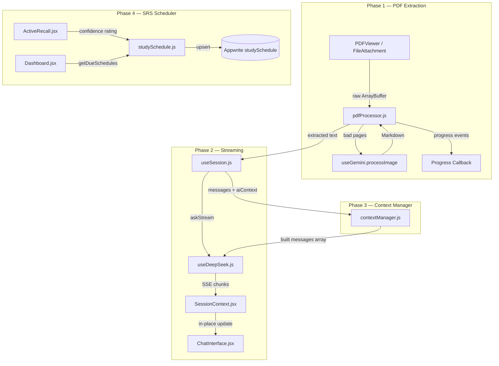

# Design Document — Omni-Content Pipeline

## Overview

The Omni-Content Pipeline is a four-phase upgrade to the LastWeek AI study platform. Each phase is independently deployable and addresses a distinct bottleneck:

| Phase | Problem | Solution |
|-------|---------|----------|
| 1 — Smart PDF Extraction | Scanned/image PDFs yield zero or garbled text | Quality-detect pages after PDF.js; route bad pages to Gemini Vision OCR |
| 2 — Streaming Responses | 10–30 s blocking spinner before any text appears | SSE streaming from DeepSeek; in-place message updates in SessionContext |
| 3 — Smart Context Window | Hard `substring(0, 15000)` silently drops context | Token-budget-aware (28 k) sliding window + session memory block |
| 4 — Spaced Repetition Scheduler | Confidence ratings discarded after one-shot date calc | Full SM-2 state persisted per (userId, sessionId, topic); Dashboard "Due for Review" |

The four phases share the existing module boundaries (`useDeepSeek`, `useGemini`, `useSession`, `SessionContext`, `database.js`) and introduce three new modules: `pdfProcessor.js`, `contextManager.js`, and `studySchedule.js`.

---

## Architecture

### Module Interaction Diagram



### Data Flow per Phase

**Phase 1 — PDF Processing Pipeline**
```
User uploads PDF
  → FileAttachment / PDFViewer reads ArrayBuffer
  → pdfProcessor.extractText(arrayBuffer, { onProgress })
      for each page:
        PDF.js extracts text items
        if (textItems.length === 0 || garbageRatio > 0.3):
          render page to canvas (scale 1.5) → toDataURL('image/png')
          call useGemini.processImage(base64, ocrPrompt) → Markdown
          wrap in === PAGE X === ... === END PAGE X ===
        else:
          use PDF.js text directly
        onProgress({ pageNum, method, charCount, garbageRatio })
  → returns combined text string
  → useSession.sendMessageWithAI receives extracted text
```

**Phase 2 — Streaming Message Flow**
```
User sends message
  → useSession.sendMessageWithAI
  → contextManager.buildContextMessages(...)
  → SessionContext.sendMessageStreaming(userMsg, streamCallback)
      creates placeholder AI message in state (id: temp-{timestamp})
      calls streamCallback(onChunk):
        useDeepSeek.askStream(systemPrompt, messages, onChunk)
          fetch with stream: true → ReadableStream
          SSE parser: for each data: chunk → extract delta → onChunk(delta)
          on [DONE]: resolve with assembled text
      onChunk(delta):
        setMessages(prev => prev.map(m =>
          m.$id === placeholderId ? { ...m, content: m.content + delta } : m
        ))
      on completion:
        createMessage(sessionId, userId, 'assistant', fullText)  ← exactly once
        replace placeholder with persisted message
```

**Phase 3 — Context Building Pipeline**
```
useSession.sendMessageWithAI(aiContextMessage, ...)
  → contextManager.buildContextMessages(messages, aiContextMessage, activeSession, 28000)
      1. Build priming messages (always retained, 2 messages)
      2. If session has >3 AI responses: build Session Memory block
         (last 3 AI responses, each truncated to 500 chars, joined by \n)
      3. Collect historical messages (strip large PDF blocks)
      4. Sliding window: add messages newest-first until budget exhausted
         (never drop below 2 user/assistant pairs)
      5. If page context present: include focused page (current ± 1)
         count against budget; trim to single page if still over budget
      6. Log evictions to console
  → returns { messages: [...], tokenEstimate: N }
```

**Phase 4 — SRS Scheduler Flow**
```
ActiveRecall: user clicks confidence rating (1/2/3)
  → handleConfidenceRating(confidence)
  → studySchedule.upsertStudySchedule(userId, sessionId, subject, topic, confidence)
      query existing record for (userId, sessionId, topic)
      if not found: create with initial SM-2 state
      if found: apply SM-2 update formula
      write to Appwrite studySchedule collection
      on failure: show dismissible toast (non-blocking)

Dashboard loads
  → studySchedule.getDueSchedules(userId)
      query studySchedule where userId = X AND nextReviewDate <= today
  → render "Due for Review" section
```

---

## Components and Interfaces

### Phase 1 — `src/utils/pdfProcessor.js` (new)

```js
/**
 * @param {ArrayBuffer} arrayBuffer  - Raw PDF binary data
 * @param {Object}      options
 * @param {Function}    options.onProgress  - Called once per page:
 *                        ({ pageNum: number, method: 'pdfjs'|'vision',
 *                           charCount: number, garbageRatio: number }) => void
 * @param {Function}    options.processImage - Gemini Vision caller:
 *                        (base64: string, prompt: string) => Promise<string>
 * @param {number}      [options.garbageThreshold=0.3]
 * @param {number}      [options.canvasScale=1.5]
 * @returns {Promise<string>}  Combined extracted text
 * @throws  {Error}            If no page yields non-placeholder content
 */
export async function extractText(arrayBuffer, options) { ... }

/**
 * Compute the ratio of garbage characters in a string.
 * Garbage = non-printable (< 0x20 except \t\n\r), U+FFFD,
 *           or characters outside BMP that are not CJK Unified Ideographs.
 * @param {string} text
 * @returns {number}  Ratio in [0, 1]
 */
export function computeGarbageRatio(text) { ... }

/**
 * Classify a page as 'good' or 'bad'.
 * @param {string[]} textItems   - Raw text items from PDF.js
 * @param {number}   threshold   - Garbage ratio threshold (default 0.3)
 * @returns {'good'|'bad'}
 */
export function classifyPage(textItems, threshold = 0.3) { ... }

/**
 * Wrap page content in the standard page-block format.
 * @param {number} pageNum
 * @param {string} content
 * @returns {string}
 */
export function wrapPageContent(pageNum, content) { ... }
```

The `extractText` function accepts `processImage` as an injected dependency (rather than importing `useGemini` directly) so it can be called from both React hooks and plain utility contexts, and to keep it unit-testable without React.

### Phase 2 — `src/hooks/useDeepSeek.js` (modified)

New method added alongside the existing `ask`:

```js
/**
 * Stream a DeepSeek response via SSE.
 * @param {string}   systemPrompt
 * @param {Object[]} messagesHistory
 * @param {Function} onChunk  - Called with each text delta: (delta: string) => void
 * @returns {Promise<string>}  Fully assembled response text
 */
const askStream = async (systemPrompt, messagesHistory, onChunk, retryCount = 0) => { ... }
```

SSE parsing logic:
```
ReadableStream → TextDecoder → line buffer
for each line:
  if line.startsWith('data: '):
    payload = line.slice(6).trim()
    if payload === '[DONE]': resolve(assembled)
    else: delta = JSON.parse(payload).choices[0].delta.content ?? ''
          assembled += delta
          onChunk(delta)
```

Retry: on network error before `[DONE]`, retry up to 2 times with 2 s delay (same logic as existing `makeRequest`).

### Phase 2 — `src/context/SessionContext.jsx` (modified)

New method `sendMessageStreaming` added to the context value:

```js
/**
 * Send a user message and stream the AI response.
 * @param {string}   userMessage        - Display text saved to DB
 * @param {Function} streamCallback     - async (onChunk) => string
 *                     Caller calls onChunk(delta) for each chunk;
 *                     resolves with the full assembled text.
 * @param {Object}   [fileAttachment]
 * @returns {Promise<Object>}  The persisted AI message document
 */
const sendMessageStreaming = async (userMessage, streamCallback, fileAttachment = null) => { ... }
```

State additions:
```js
const [isStreaming, setIsStreaming] = useState(false);
```

The `isStreaming` flag is exposed in the context value and used by `ChatInterface` to disable the send button and show the typing indicator.

Placeholder message shape (local-only, not persisted):
```js
{
  $id: `streaming-${Date.now()}`,
  role: 'assistant',
  content: '',
  isStreaming: true,
  createdAt: new Date().toISOString()
}
```

### Phase 2 — `src/hooks/useSession.js` (modified)

`sendMessageWithAI` routes through `sendMessageStreaming` instead of `sendMessage`. The Gemini pre-analysis step (for file uploads) runs first (blocking), then streaming begins. A separate `isAnalysing` state is surfaced for the "Analysing…" indicator during Gemini pre-analysis.

### Phase 2 — `src/components/ChatInterface.jsx` (modified)

- Accepts `isStreaming` prop (from `useSession` context).
- When `isStreaming` is true: send button is disabled; the streaming message renders with a blinking cursor `▋` appended after the current text.
- The existing `LoadingDots` spinner is shown only during non-streaming loading (e.g., Gemini pre-analysis).

### Phase 3 — `src/utils/contextManager.js` (new)

```js
/**
 * Build the messages array for a DeepSeek API call.
 *
 * @param {Object[]} messages        - Full session message history (from SessionContext)
 * @param {string}   aiContextMessage - The current user's context-enriched message
 * @param {Object}   activeSession   - { subject, mode }
 * @param {number}   [tokenBudget=28000]
 * @param {Object}   [options]
 * @param {number}   [options.currentPage]  - For PDF study mode
 * @param {string}   [options.pageContext]  - Full extracted text for page windowing
 * @returns {{ messages: Object[], tokenEstimate: number, evictedCount: number }}
 */
export function buildContextMessages(messages, aiContextMessage, activeSession, tokenBudget = 28000, options = {}) { ... }

/**
 * Estimate token count for a messages array.
 * @param {Object[]} messages  - Array of { role, content }
 * @returns {number}
 */
export function estimateTokens(messages) {
  const totalChars = messages.reduce((sum, m) => sum + m.role.length + m.content.length, 0);
  return Math.ceil(totalChars / 4);
}

/**
 * Build the Session Memory block from the last N AI responses.
 * @param {Object[]} messages   - Full message history
 * @param {number}   [n=3]      - Number of AI responses to include
 * @param {number}   [maxChars=500] - Max chars per response
 * @returns {string|null}       - Null if fewer than 4 AI responses exist
 */
export function buildSessionMemory(messages, n = 3, maxChars = 500) { ... }
```

**Eviction algorithm** (pseudocode):
```
1. Start with: [priming[0], priming[1]]
2. If sessionMemory exists: add sessionMemory message
3. Collect historical pairs (user+assistant) newest-first
4. Add pairs until tokenEstimate > budget, keeping minimum 2 pairs
5. If pageContext: add focused page block; if still over budget, trim to single page
6. Add newMessage (current user turn)
7. Log evictions if any
```

### Phase 4 — `src/appwrite/studySchedule.js` (new)

```js
const STUDY_SCHEDULE_COLLECTION_ID = import.meta.env.VITE_APPWRITE_STUDY_SCHEDULE_COLLECTION_ID;

/**
 * Create or update a StudySchedule record.
 * @param {string} userId
 * @param {string} sessionId
 * @param {string} subject
 * @param {string} topic       - First 80 chars of last AI question, or session subject
 * @param {number} confidence  - 1 (hard) | 2 (okay) | 3 (easy)
 * @returns {Promise<Object>}  The upserted Appwrite document
 */
export async function upsertStudySchedule(userId, sessionId, subject, topic, confidence) { ... }

/**
 * Get all StudySchedule records due for review today or earlier.
 * @param {string} userId
 * @returns {Promise<Object[]>}
 */
export async function getDueSchedules(userId) { ... }

/**
 * Apply SM-2 update formula to an existing schedule record.
 * @param {Object} record   - Existing { interval, easeFactor, repetitions }
 * @param {number} confidence
 * @returns {Object}        - Updated { interval, easeFactor, repetitions, nextReviewDate }
 */
export function applySM2(record, confidence) { ... }
```

### Phase 4 — `src/pages/modes/ActiveRecall.jsx` (modified)

`handleConfidenceRating` is extended to call `upsertStudySchedule`. Topic is derived from the last AI message text (first 80 characters), falling back to `activeSession.subject`.

### Phase 4 — `src/pages/Dashboard.jsx` (modified)

New "Due for Review" section added above "Recent Study Sessions". Queries `getDueSchedules(user.$id)` in `loadDashboardData`. Error is isolated to the section.

---

## Data Models

### Phase 1 — Page Processing Result

```ts
interface PageResult {
  pageNum: number;
  method: 'pdfjs' | 'vision';
  content: string;          // wrapped in === PAGE X === ... === END PAGE X ===
  charCount: number;
  garbageRatio: number;
  isPlaceholder: boolean;
}
```

### Phase 2 — Streaming Message (local state only)

```ts
interface StreamingMessage {
  $id: string;              // 'streaming-{timestamp}' — replaced on persist
  role: 'assistant';
  content: string;          // grows with each chunk
  isStreaming: boolean;     // true until [DONE]
  createdAt: string;        // ISO timestamp
}
```

### Phase 3 — Context Build Result

```ts
interface ContextBuildResult {
  messages: Array<{ role: 'user' | 'assistant' | 'system'; content: string }>;
  tokenEstimate: number;
  evictedCount: number;
  hasSessionMemory: boolean;
}
```

### Phase 4 — StudySchedule (Appwrite document)

| Field | Type | Description |
|-------|------|-------------|
| `userId` | string | Appwrite user ID |
| `sessionId` | string | Appwrite session document ID |
| `subject` | string | Study subject (e.g., "Organic Chemistry") |
| `topic` | string | First 80 chars of last AI question, or subject |
| `nextReviewDate` | string | ISO 8601 date `YYYY-MM-DD` (UTC) |
| `interval` | integer | Days until next review |
| `easeFactor` | float | SM-2 ease factor ∈ [1.3, 4.0] |
| `repetitions` | integer | Consecutive successful reviews |

**Appwrite collection indexes required:**
- `userId` (key index) — for user-scoped queries
- `nextReviewDate` (key index) — for due-date range queries
- Composite `(userId, sessionId, topic)` — for upsert lookup

### Phase 4 — SM-2 Update Logic

```
confidence mapping:
  1 (hard)  → quality 0
  2 (okay)  → quality 3
  3 (easy)  → quality 5

On confidence = 1 (hard):
  repetitions = 0
  interval    = 1
  easeFactor  = max(1.3, easeFactor - 0.2)
  nextReviewDate = today + 1 day

On confidence = 2 (okay):
  repetitions += 1
  interval    = max(1, floor(interval × easeFactor × 0.9))
  easeFactor  = unchanged
  nextReviewDate = today + interval days

On confidence = 3 (easy):
  repetitions += 1
  interval    = max(1, floor(interval × easeFactor))
  easeFactor  = min(4.0, easeFactor + 0.1)
  nextReviewDate = today + interval days

Initial state (new record):
  repetitions = 0
  interval    = 1
  easeFactor  = 2.5
  nextReviewDate = today + 1 day
```

---


## Correctness Properties

*A property is a characteristic or behavior that should hold true across all valid executions of a system — essentially, a formal statement about what the system should do. Properties serve as the bridge between human-readable specifications and machine-verifiable correctness guarantees.*

### Property Reflection

Before listing properties, redundancy is eliminated:

- 1.1 (zero-text → bad) and 1.2 (garbage ratio → bad) both test `classifyPage`. They can be combined into one property: "for any page, classifyPage returns 'bad' iff textItems is empty OR garbageRatio > threshold."
- 2.2 (SSE chunk parsing) and 2.3 (assembled text = concatenation of chunks) are both about the streaming assembly invariant. They can be combined: "for any sequence of chunks, the assembled text equals their concatenation."
- 3.1 (token budget never exceeded) and 3.5 (eviction order) are related but test different invariants — budget enforcement vs. eviction priority. Both are retained as they catch different bugs.
- 3.2 (priming messages always retained) and 3.6 (no mid-string truncation) are distinct invariants. Both retained.
- 4.3, 4.4, 4.5 (SM-2 update formulas for each confidence level) can be combined into one comprehensive SM-2 invariant property covering all three confidence levels and their respective EF bounds.
- 4.6 (getDueSchedules filter) and 4.7 (days-overdue calculation) are distinct pure functions. Both retained.

---

### Property 1: Page classification correctness

*For any* list of text items extracted from a PDF page, `classifyPage` SHALL return `'bad'` if and only if the list is empty OR the garbage-character ratio of the joined text exceeds the configured threshold (default 0.3); otherwise it SHALL return `'good'`.

**Validates: Requirements 1.1, 1.2**

---

### Property 2: Page content wrapper format

*For any* page number and any content string, `wrapPageContent(pageNum, content)` SHALL return a string that starts with `=== PAGE {pageNum} ===`, ends with `=== END PAGE {pageNum} ===`, and contains the original content string verbatim between those markers.

**Validates: Requirements 1.5**

---

### Property 3: Progress callback invoked exactly once per page

*For any* N-page PDF processed by `extractText`, the `onProgress` callback SHALL be invoked exactly N times — once per page, in ascending page-number order — and each invocation SHALL include `pageNum` (integer), `method` (`'pdfjs'` or `'vision'`), `charCount` (non-negative integer), and `garbageRatio` (float in [0, 1]).

**Validates: Requirements 1.8**

---

### Property 4: All-placeholder PDF throws

*For any* set of page results where every page is a placeholder (i.e., no page has non-placeholder content), `extractText` SHALL throw an error. *For any* set of page results where at least one page has non-placeholder content, `extractText` SHALL return a non-empty string.

**Validates: Requirements 1.7**

---

### Property 5: Streaming assembly invariant

*For any* sequence of text chunk deltas delivered via SSE, the fully assembled response text SHALL equal the exact concatenation of all deltas in the order they were received. No delta SHALL be dropped, duplicated, or reordered.

**Validates: Requirements 2.2, 2.3**

---

### Property 6: In-place streaming message accumulation

*For any* sequence of N streaming chunks delivered to `sendMessageStreaming`, after chunk K has been processed the placeholder message's `content` field in the React state SHALL equal the concatenation of chunks 1 through K.

**Validates: Requirements 2.4**

---

### Property 7: Context token budget never exceeded

*For any* session message history and any AI context message, `buildContextMessages` SHALL return a messages array whose token estimate (`ceil(totalChars / 4)`) does not exceed 28,000 — except when the mandatory minimum (2 priming messages + 2 user/assistant pairs) alone exceeds the budget, in which case those messages are still included.

**Validates: Requirements 3.1**

---

### Property 8: Priming messages always retained and messages never truncated mid-string

*For any* session message history that triggers eviction, the output of `buildContextMessages` SHALL always contain both priming messages as exact, unmodified strings. Furthermore, every message present in the output SHALL be an exact copy of a message from the input — no message SHALL appear in the output in a partially truncated form.

**Validates: Requirements 3.2, 3.6**

---

### Property 9: Session Memory block character limits

*For any* session with more than 3 AI responses where older messages are being evicted, the Session Memory block prepended by `buildContextMessages` SHALL contain at most 3 AI response segments, each segment SHALL be at most 500 characters, and the total Session Memory block SHALL NOT exceed 1,500 characters.

**Validates: Requirements 3.3**

---

### Property 10: SM-2 invariants across all confidence levels

*For any* existing StudySchedule record and any confidence rating (1, 2, or 3), `applySM2` SHALL produce an updated record satisfying all of the following invariants simultaneously:
- `easeFactor` ∈ [1.3, 4.0]
- `interval` ≥ 1
- `nextReviewDate` is strictly after the current UTC date (i.e., at least today + 1 day)
- On confidence = 1: `repetitions` = 0, `interval` = 1, `easeFactor` = max(1.3, previous − 0.2)
- On confidence = 2: `repetitions` = previous + 1, `interval` = max(1, floor(prev × EF × 0.9)), `easeFactor` unchanged
- On confidence = 3: `repetitions` = previous + 1, `interval` = max(1, floor(prev × EF)), `easeFactor` = min(4.0, previous + 0.1)

**Validates: Requirements 4.3, 4.4, 4.5**

---

### Property 11: Due schedules filter correctness

*For any* set of StudySchedule records with varying `nextReviewDate` values, `getDueSchedules` SHALL return exactly those records whose `nextReviewDate` is on or before the current UTC calendar date, and SHALL NOT return any record whose `nextReviewDate` is after the current UTC calendar date.

**Validates: Requirements 4.6**

---

### Property 12: Days-overdue calculation correctness

*For any* due StudySchedule record, the days-overdue value displayed on the Dashboard SHALL equal `floor((currentUTCDate − nextReviewDate) in whole days)`, and SHALL be 0 when `nextReviewDate` equals the current UTC date.

**Validates: Requirements 4.7**

---

## Error Handling

### Phase 1 — PDF Extraction Errors

| Scenario | Handling |
|----------|----------|
| PDF.js fails to load document | Throw immediately with descriptive message; no partial results |
| Canvas render fails for a bad page | Insert placeholder `[Page X: image-only — could not extract text]`; continue |
| Gemini Vision call fails or times out (30 s) | Insert placeholder; continue; log warning |
| All pages are placeholders | Throw `Error('PDF extraction failed: no readable content found in any page')` |
| Gemini Vision rate limit (429) | Insert placeholder; log warning with suggestion to retry |

### Phase 2 — Streaming Errors

| Scenario | Handling |
|----------|----------|
| SSE connection drops before `[DONE]` | Retry up to 2 times with 2 s delay; on final failure, surface error via `setError` |
| JSON parse error on SSE chunk | Skip malformed chunk; log warning; continue stream |
| DeepSeek 429 / 5xx during stream | Treat as network error; apply retry logic |
| Gemini pre-analysis fails (file upload path) | Fall back to `aiContextMessage.substring(0, 15000)` (existing behaviour); streaming still proceeds |

### Phase 3 — Context Manager Errors

| Scenario | Handling |
|----------|----------|
| Token budget cannot be met even with minimum messages | Include minimum messages anyway; log warning |
| Message history is empty | Return only priming messages + new message |
| `pageContext` is null/undefined | Skip page context block; proceed without it |

### Phase 4 — SRS Scheduler Errors

| Scenario | Handling |
|----------|----------|
| Appwrite write fails | Show dismissible toast notification for ≥ 5 s; do not block or throw in Active Recall |
| Appwrite query fails on Dashboard | Display error message inside "Due for Review" section only; rest of Dashboard unaffected |
| Topic extraction yields empty string | Fall back to `activeSession.subject` |
| `nextReviewDate` calculation produces past date | Clamp to today + 1 day minimum |

---

## Testing Strategy

### Property-Based Testing Library

**[fast-check](https://github.com/dubzzz/fast-check)** (TypeScript/JavaScript) is used for all property-based tests. It is already compatible with Vitest (the project's test runner, inferred from `package.json`).

Install: `npm install --save-dev fast-check`

Each property test runs a minimum of **100 iterations** (`numRuns: 100`).

Tag format for each test: `// Feature: omni-content-pipeline, Property {N}: {property_text}`

### Unit Tests (example-based)

Focused on specific scenarios, edge cases, and integration points:

**Phase 1:**
- Canvas render is called with scale ≥ 1.5 (mock `page.render`)
- Vision Fallback placeholder inserted when Gemini throws
- Vision Fallback placeholder inserted when Gemini times out (30 s)
- `extractText` throws when all pages are placeholders

**Phase 2:**
- `askStream` calls `createMessage` exactly once on completion (mock Appwrite)
- Send button is disabled while `isStreaming = true`
- Retry fires at most 2 times on network error (mock fetch)
- `[DONE]` sentinel closes the stream

**Phase 3:**
- `buildContextMessages` includes focused page context when `currentPage` is provided
- Eviction count is logged to `console.log` when messages are dropped
- Minimum 2 user/assistant pairs are retained even when budget is tight

**Phase 4:**
- New StudySchedule record initialised with `repetitions=0, easeFactor=2.5, interval=1`
- Dashboard renders "No reviews due today" when `getDueSchedules` returns `[]`
- Clicking a due item navigates to the correct session URL
- Appwrite write failure shows toast without throwing in Active Recall
- Appwrite query failure shows error in "Due for Review" section only

### Integration Tests

- Phase 1: End-to-end extraction of a known scanned PDF page via Gemini Vision (1–2 examples)
- Phase 2: Full streaming round-trip with a mocked DeepSeek SSE endpoint
- Phase 4: Appwrite `studySchedule` collection schema validation (smoke test)

### Property Test Configuration

```js
// vitest.config.js — no changes needed; fast-check works with Vitest out of the box

// Example property test structure:
import { describe, it, expect } from 'vitest';
import fc from 'fast-check';
import { applySM2 } from '../src/appwrite/studySchedule';

describe('omni-content-pipeline — SM-2 invariants', () => {
  it('Property 10: SM-2 invariants across all confidence levels', () => {
    // Feature: omni-content-pipeline, Property 10: SM-2 invariants across all confidence levels
    fc.assert(
      fc.property(
        fc.record({
          interval: fc.integer({ min: 1, max: 365 }),
          easeFactor: fc.float({ min: 1.3, max: 4.0 }),
          repetitions: fc.integer({ min: 0, max: 100 })
        }),
        fc.integer({ min: 1, max: 3 }),
        (record, confidence) => {
          const result = applySM2(record, confidence);
          expect(result.easeFactor).toBeGreaterThanOrEqual(1.3);
          expect(result.easeFactor).toBeLessThanOrEqual(4.0);
          expect(result.interval).toBeGreaterThanOrEqual(1);
          // nextReviewDate is at least today + 1
          const today = new Date().toISOString().slice(0, 10);
          expect(result.nextReviewDate > today).toBe(true);
        }
      ),
      { numRuns: 100 }
    );
  });
});
```

---

## File Change Summary

### New Files

| File | Description |
|------|-------------|
| `src/utils/pdfProcessor.js` | PDF extraction pipeline: quality detection, canvas render, Vision Fallback, progress callback |
| `src/utils/contextManager.js` | Token-budget-aware context builder: sliding window, session memory, page context |
| `src/appwrite/studySchedule.js` | SM-2 scheduler: `upsertStudySchedule`, `getDueSchedules`, `applySM2` |

### Modified Files

| File | Change |
|------|--------|
| `src/hooks/useDeepSeek.js` | Add `askStream(systemPrompt, messages, onChunk)` SSE streaming method |
| `src/context/SessionContext.jsx` | Add `sendMessageStreaming`, `isStreaming` state, expose both in context value |
| `src/hooks/useSession.js` | Route through `sendMessageStreaming`; delegate context building to `contextManager.js` |
| `src/components/ChatInterface.jsx` | Accept `isStreaming` prop; show blinking cursor on streaming message; disable send during stream |
| `src/pages/modes/ActiveRecall.jsx` | Extend `handleConfidenceRating` to call `upsertStudySchedule`; derive topic from last AI message |
| `src/pages/Dashboard.jsx` | Add "Due for Review" section; call `getDueSchedules`; handle isolated error state |
| `src/appwrite/database.js` | No changes required (studySchedule CRUD is in its own module) |
| `.env` | Add `VITE_APPWRITE_STUDY_SCHEDULE_COLLECTION_ID` |

### Appwrite Schema Changes

| Change | Description |
|--------|-------------|
| New collection: `studySchedule` | Fields: `userId`, `sessionId`, `subject`, `topic`, `nextReviewDate`, `interval`, `easeFactor`, `repetitions` |
| New indexes on `studySchedule` | Key index on `userId`; key index on `nextReviewDate`; composite index on `(userId, sessionId, topic)` |
